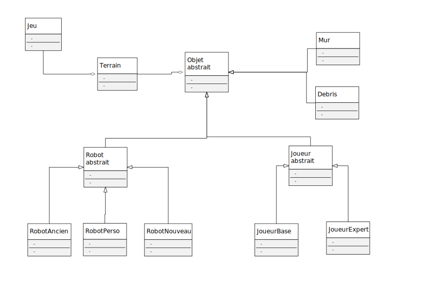

# Projet-POO

**Mémo GitHub / Git**

** **

Créer un compte sur https://github.com

Installer git : https://git-scm.com/downloads

Dans votre ligne de commande, tapez :

`git config --global user.name "[Prenom] [Nom]"`

`git config --global user.email "[username]@[…]"`

Afin de vous créer un clone de travail local, tapez :

`git clone https://github.com/vdidon/Projet-POO-git.git` 

Cela a pour effet de créer un dossier [Projet-POO-git] dans lequel vous pourrez travailler.

**Commandes git courantes**

`git status`

Permet de connaître l'état actuel de votre dépôt local : liste des fichiers sous contrôle contenant des modifications, liste des fichiers présents et non contrôlés, etc.

`git remote -v`

Permet de voir la liste des dépôts distants connus (origin est le nom du dépôt distant depuis lequel le dépôt local a été cloné)

`git diff [file]`

Permet de voir les modifications apportées à un fichier et non encore commitées

`git checkout -- [file]`

Permet d'annuler les modifications apportées à un fichier et de le remettre dans l'état où il était précédemment

`git add [file]`

Permet d'ajouter un fichier non contrôlé au dépôt lors du prochain commit

`git add --all`

Permet d'ajouter tous les fichiers non contrôlé au dépôt lors du prochain commit

`git reset HEAD [file]`

Permet d'enlever un fichier de la liste des fichiers à ajouter au prochain commit

`git commit -m "..."`

Permet d'ajouter un commit au dépôt (sous réserve d'avoir fait au moins un add avant). Cette commande permet de saisir le message du commit et voir au passage la liste des fichiers concernés

`git commit --all -m "..."`

Permet d'ajouter un commit au dépôt sans faire de add avec tout les fichiers modifié (attention ne marche pas pour la création de nouveaux fichiers)

`git pull`

Récupère les commits du dépôt d'origine dont le dépôt local ne dispose pas encore

`git push`

Envoie vers le dépôt d'origine les commits dont il ne dispose pas encore (vous pouvez constater sur l'interface web GitHub que vos nouveaux commits ont bien été ajoutés)

**Mise en commun du travail**

Une fois que vous avez créé des commits dans votre dépôt de travail (`git commit`) et envoyé ces commits dans votre dépôt distant (`git push`), vous allez pouvoir les proposer pour intégration au sein du dépôt commun du groupe.

**Securiser son compte**

Pas obligatoire mais fortement recommandé, chaqu'un peut choisir de le faire ou non.

Par défault l'identification se fait avec uniquement l'adresse mail, c'est à dire que n'importe qui peut faire de modification en votre nom !

La solution est de générer une clé de chiffrement personel et de l'ajouter dans github

https://help.github.com/en/github/authenticating-to-github/generating-a-new-ssh-key-and-adding-it-to-the-ssh-agent#generating-a-new-ssh-key (pas besoin d'ajouter à ssh-agent)

https://help.github.com/en/github/authenticating-to-github/adding-a-new-ssh-key-to-your-github-account